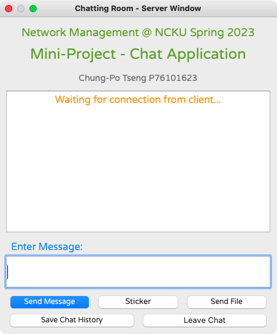
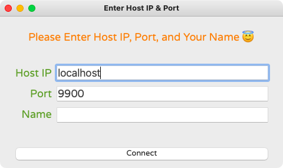
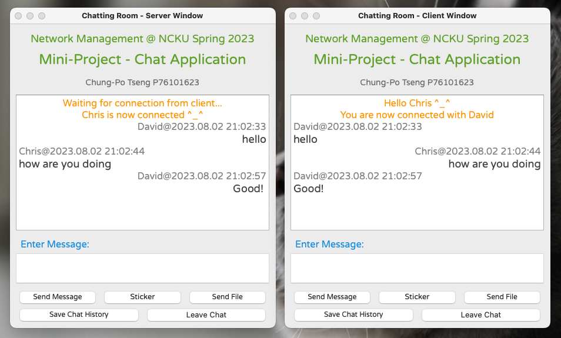

# 1 to 1 Chat Application

> Final Project of Network Management [IM7021E] 2023 Spring @ NCKU

## Introduction

- PyQt5 was used for GUI
- Python socket programming to send data between server and client (1 to 1 chat)
- Has been tested on MacOS & Ubuntu

## Features

- Send text message
- Send file
- Send sticker
- Save chat history

## Getting Started

### Start server first

```bash
python3 startServer.py
```

### Enter server IP, port, and server's nickname

- IP default value: `localhost`
- Port default value: `9900`

<p align=center>
    
</p>

### Wait for client

<p align=center>
    
</p>

### Start client

```bash
python3 startClient.py
```

### Client enter server IP, port, and client's nickname

<p align=center>
    
</p>

### Start chatting

<p align=center>
    
</p>